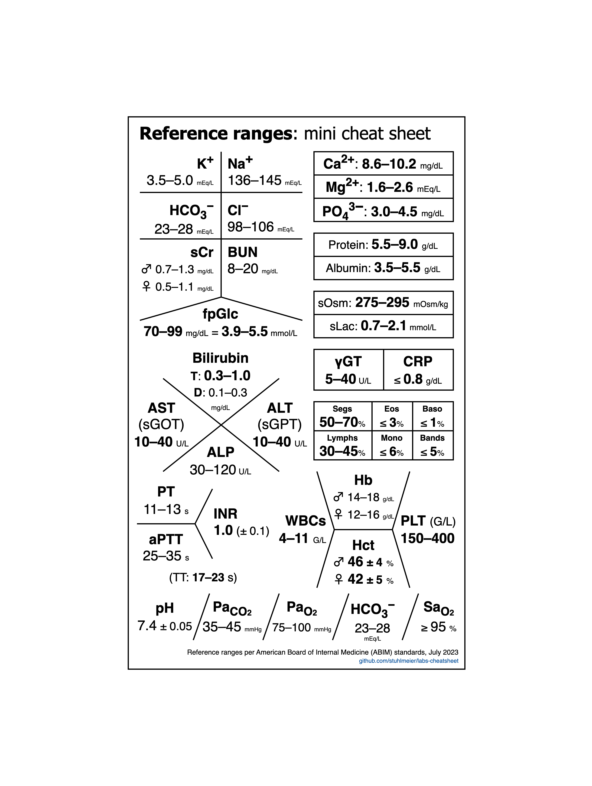

# Laboratory reference range mini cheat sheet

I made this for use as my phone wallpaper, but perhaps this can be of use to others as well.

The reference ranges used are from the ABIM's official [laboratory test reference range list](https://www.abim.org/Media/bfijryql/laboratory-reference-ranges.pdf) as of July 2023.

**Note**: the upper left fishbone diagram (BMP) is rotated 90° clockwise 
in order to fit it in the available space; this is not its usual 
orientation.

